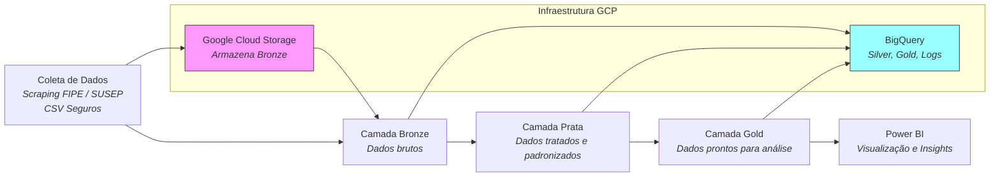
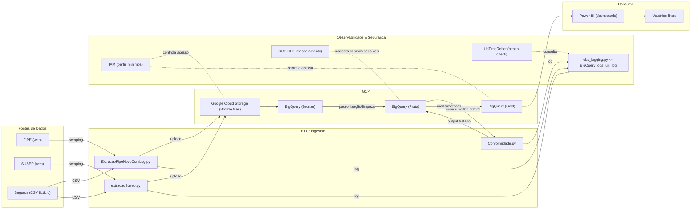

BuscaCar - Plataforma de Análise e Comparação de Veículos

## Sumário
- [Objetivo](#objetivo)
- [Arquitetura Conceitual](#arquitetura-conceitual)
- [Arquitetura de Solução](#Arquitetura-de-Solução)
- [Tecnologias Utilizadas](#Tecnologias-Utilizadas)
- [Diagramas do Projeto](#diagramas-projeto)
- [Estrutura de Pastas](#Estrutura-de-Pastas)
- [Execução do Projeto](#Execução-do-Projeto)
- [Visualização no Power BI](#Visualização-no-Power-BI)
- [Observabilidade](#observabilidade)
- [Segurança & Mascaramento](#segurança--mascaramento)
- [Reprodutibilidade](#reprodutibilidade)
- [Melhorias Futuras](#melhorias-futuras)
  
## Objetivo

O BuscaCar é uma solução de Engenharia de Dados voltada para análise e comparação de preços de veículos, utilizando a Tabela FIPE, cruzando com dados fictícios de seguros e índices de roubo de veículos (SUSEP).
O objetivo é fornecer insights de valor, visão de risco de roubo e previsibilidade de preços e custos associados à posse de um veículo.
Público-alvo: lojistas do setor automotivo, compradores exigentes, entusiastas de carros e analistas de mercado.

Objetivos do Projeto

Coleta automatizada de dados da Tabela FIPE.
Base comparativa com histórico de valores de veículos.
Análises de custo usando dados de seguros fictícios.
Coleta automatizada de dados da SUSEP.
Visualizações acessíveis via dashboard.
Pipeline de dados robusto, escalável e observável.

## Arquitetura Conceitual

1. **Coleta de Dados**
   - Web scraping da Tabela FIPE.
   - Ingestão de dados fictícios de seguros (CSV manual).
   - Web scraping da Tabela SUSEP.
   
2. **Camadas de Processamento**
   - **Bronze:** Dados brutos da FIPE, SUSEP e seguros.
   - **Silver:** Dados tratados, formatados e limpos.
   - **Gold:** Dados prontos para análise e consumo de BI.

3. **Armazenamento**
   - Google Cloud Storage (staging).
   - BigQuery como data warehouse.
     
4. **Visualização**
   - Power BI.

5. **Observabilidade e Segurança** 
   Observabilidade: monitoramento de pipelines com UpTimeRobot e logs no BigQuery.
   Segurança: controle de acesso via IAM, mascaramento de dados sensíveis com GCP DLP.
   
## Arquitetura de Solução

##Tecnologias Utilizadas

| Componente      | Tecnologia                         |
| --------------- | ---------------------------------- |
| Armazenamento   | Google Cloud Storage + BigQuery    |
| Coleta de Dados | Python (BeautifulSoup, Requests)   |
| Orquestração    | Terraform (infraestrutura buckets) |
| Visualização    | Power BI                           |
| Segurança       | GCP DLP + IAM                      |
| Observabilidade | UpTimeRobot + logs no BigQuery     |

## Diagramas do Projeto

***Outros diagramas (sequência, Gantt, classes) estão disponíveis na pasta documentos/.

#Estrutura de Pastas

├── documentos/ # Diagramas Mermaid (.mmd)
│ ├── arquitetura_tecnica.mmd
│ ├── fluxo_sequencia_principal.mmd
│ ├── fluxo_sequencia_falha.mmd
│ ├── diagrama_gantt_macro.mmd
│ ├── diagrama_gantt_sprints.mmd
│ ├── diagrama_classes_dominio.mmd
│ └── diagrama_classes_pipeline.mmd
├── ExtracaoFipeNovoComLog.py # Ingestão FIPE -> Bronze
├── extracaoSusep.py # Ingestão SUSEP -> Bronze
├── Conformidade.py # Ajuste de nomes FIPE x SUSEP
├── obs_logging.py # Registro de execução no BQ
├── criaFipeSilver.sql # Bronze -> Prata (FIPE)
├── criaSusepSilver.sql # Bronze -> Prata (SUSEP)
├── criaGold.sql # Prata -> Gold
├── criaRunLog.sql # Criação da tabela de logs
├── DesenhoDiagramaFinal.png # Diagrama técnico (Draw.io exportado)
├── main.tf # Infraestrutura GCP via Terraform
├── variaveis.tf # Variáveis do Terraform
├── requerimentos.txt # Dependências Python
└── LEIA-ME.md # Documentação principal

#Execução do Projeto

Pré-requisitos

Terraform instalado.
Autenticação GCP:

gcloud auth application-default login

Clonando Buckets GCP com Terraform
terraform init
terraform apply -var="project_id=meu-projeto-clone"

Configuração no BigQuery

Projeto: optical-victor-463515-v8
Datasets:

bronze — dados brutos FIPE/SUSEP/seguros
silver — dados tratados (Prata)
gold — dados prontos para BI
obs — logs de execução (obs.run_log)
ref — tabelas de referência

gcloud auth application-default login
gcloud config set project optical-victor-463515-v8

python extracaoSusep.py

bq query --use_legacy_sql=false < criaFipeSilver.sql
bq query --use_legacy_sql=false < criaSusepSilver.sql
bq query --use_legacy_sql=false < criaGold.sql
bq query --use_legacy_sql=false < criaRunLog.sql

python obs_logging.py --job ingest_transform

## Observações

- Os buckets serão criados com as mesmas configurações de nome, região e classe de armazenamento.
- Certifique-se de que os nomes dos buckets não estejam em uso globalmente (nomes de buckets são únicos no mundo).

Apos o ambiente instalado rode os codigos py

#Visualização no Power BI

Conectar ao dataset gold no BigQuery.
Atualizar as visualizações e métricas.
*PDF do Dash e PBIX na pasta.

#Observabilidade

Monitoramento de jobs via UpTimeRobot (verifica logs de execução no BigQuery).
Tabela de logs (obs.run_log) contendo status, horário de início/fim e mensagens de erro.
Alertas configurados para falhas na ingestão.

#Segurança e Mascaramento

IAM: acesso restrito a usuários autorizados.
DLP: mascaramento de campos sensíveis (placa, CPF, etc.).
Criptografia: dados criptografados em repouso e em trânsito.

#Reprodutibilidade

ré-requisitos:
Python 3.10+
pip install -r requerimentos.txt
GCP SDK (gcloud) configurado
Permissões no projeto GCP

Passos:

Criar datasets no BigQuery (bronze, silver, gold, obs, ref).
Rodar scripts Python de ingestão.
Executar transformações SQL.
Publicar visualização no Power BI.

Este repositório contém:
Scripts de ingestão.
Código de transformação.
Configurações Terraform.
Instruções no README.
Passos para reprodução:
Criar projeto no GCP.
Configurar autenticação.
Criar buckets e datasets com Terraform.
Executar scripts de ingestão.
Publicar dashboard no Power BI.

#Melhorias Futuras

API pública para consulta externa.
Integração com mais fontes (MeuCarroNaWeb).
Previsão de preços com BigQuery ML.
